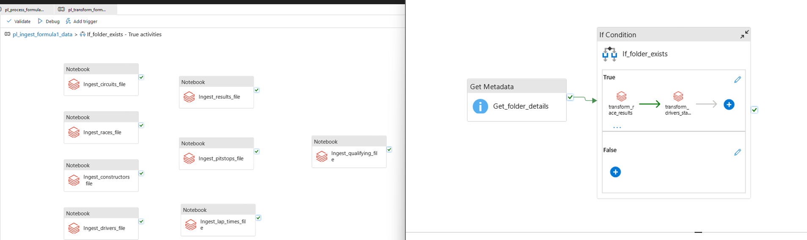

# formula1racing-analysis-spark-azure-databricks

This is an end-to-end formula1-analysis, right from hitting the `Ergast API` every week on Sunday night 10pm to get the raw data and store it in the `Bronze layer` (raw), then transform (`silver layer`), analyze and make it visual ready (`gold layer`) to get some valuable insights. The data consists of multiple files in multiple formats (csv, json, parquet). 

#### Tech stack used:

```
--> Storage - Azure Data Lake Gen 2
--> Compute - Azure Databricks - Apache Spark (Pyspark and spark SQL used interchangebly as per ease of use)
--> Workflow and automation - Azure Data Factory
--> Data Governance - Unity Catalog - Databricks
--> Data Lineage - Unity Catalog - Databricks
--> Access management - Azure Managed Identity and Service Principal
--> Cross platform connections/roles/connectors/Token management - Azure Secure Key Vault.
--> Dashboards - PowerBI (will be released to GitHub soon)
```
#### Workflow:

* Get the raw data from 'Ergast API' by calling the api every sunday night at 10pm using azure data factory trigger and store it in the raw layer.
* Create schemas/tables as per need in the transform layer.
* Analyze the data and prepare clean datasets for each race dimention field - (Circuits, Races, Constructors, Drivers, Results, Pitstops, Lap times, Qualifying (drivers/teams))
* Store all the visual ready data in presentation layer and build visualizations/Dashboards
* Once everything looks fine, build data workflows/pipelines connecting each stage using azure data factory.
* Use ADF triggers to automate the workflow as per need and monitor the results from each run in ADF.
* Finally, connect the results tables to any data vizualizationn connector and build interactive dashboards.


Here is the sample workflow


